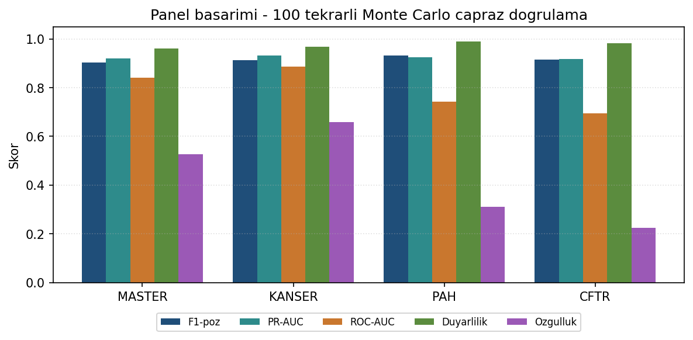
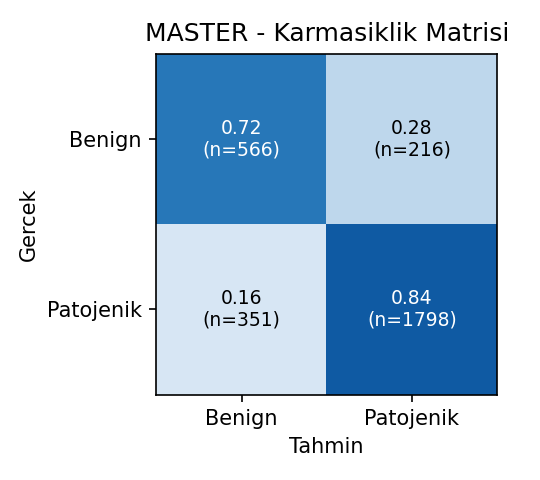
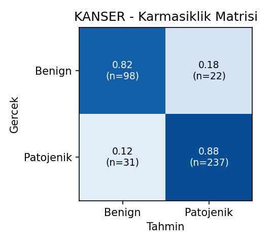
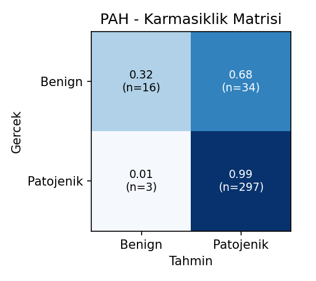
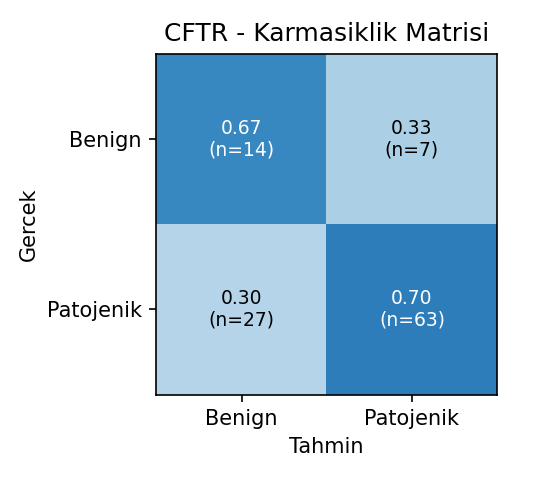
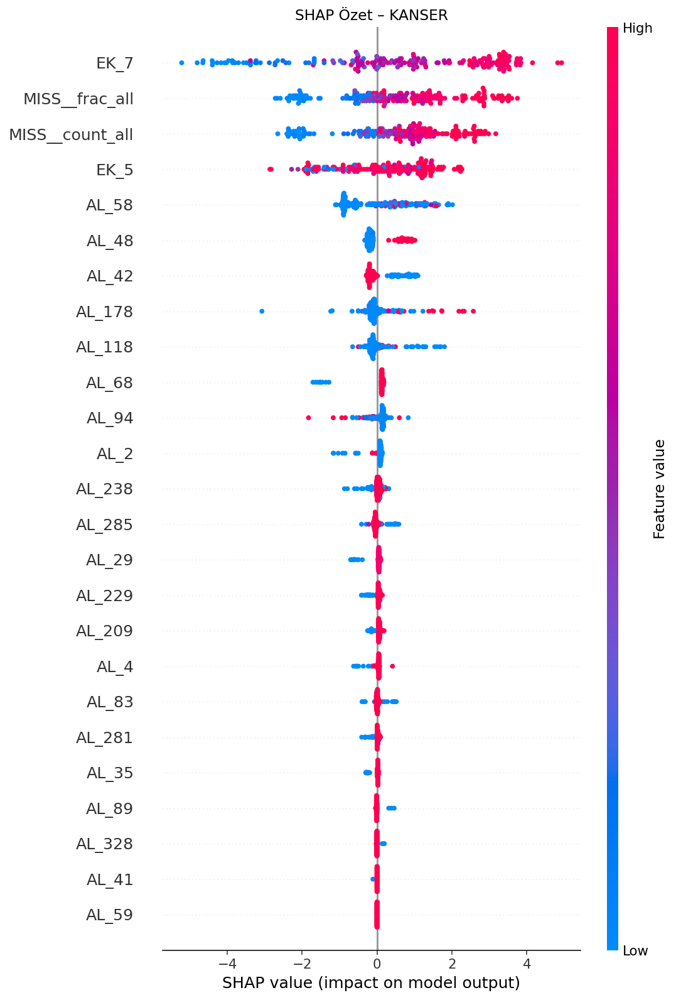

# XAI-Gen — Genetik Varyant Patojenite Sınıflandırması

**TEKNOFEST 2026 — Sağlıkta Yapay Zekâ Yarışması (Üniversite ve Üzeri)**
Takım: **XAI-Gen** · Takım ID: **5214449**

Missense genetik varyantları **patojenik (1)** veya **benign (0)** olarak sınıflandıran, dört gen paneli için ayrı ayrı eğitilen şeffaf bir makine öğrenmesi işlem hattı:
**MASTER** (genel), **KANSER** (kalıtsal kanser), **PAH** (fenilketonüri), **CFTR** (kistik fibrozis).

## Öne çıkan tasarım

- **Dağılım kaymasına dayanıklı karar eşiği.** Eğitim ~%80 patojenik iken test ~%80 benign'dir. Karar eşiği, dengeli ayrımı (Youden-J = duyarlılık+özgüllük−1) maksimize eden noktada seçilir; bu nokta **prevalanstan bağımsızdır**, dolayısıyla dağılım kaymasından etkilenmez ve ayrı bir prior-shift düzeltmesi gerektirmez (Lipton 2014; Saerens 2002).
- **Bilgilendirici eksiklik (informative missingness).** Eksik değerler bilinçlidir (NaN ≠ 0). `MISS__count/frac` ve `EK_*__isna` türev öznitelikleri MNAR sinyalini yakalar (panel-bazlı açılır).
- **Heterojen yığınlama (stacking).** CatBoost + LightGBM + XGBoost → meta-CatBoost; çok-tohumlu.
- **Sıralı İleri Özellik Seçimi (SFS).** Anonim kolonlarda gürültüyü eler; küçük/dengesiz panellerde `roc_auc` skorlamasıyla.
- **Dengeli değerlendirme.** 100 tekrarlı Monte Carlo çapraz doğrulama; dengeli (duyarlılık/özgüllük) operasyon noktasıyla raporlama.
- **Olasılık kalibrasyonu** — CV-tabanlı izotonik (PSR 4.5); monoton olduğundan F1'i değiştirmez, olasılık güvenilirliğini artırır.
- **Açıklanabilirlik (SHAP)** — TreeExplainer ile panel başına özet grafik (eşik bağımsız özellik katkıları).

## Dizin yapısı

```
.
├── config.yaml          # Tüm pipeline ayarları (panel override'ları dahil)
├── train.py             # Eğitim + değerlendirme girişi
├── predict.py           # Eğitilmiş modelle tahmin (test CSV -> 0/1 etiket)
├── requirements.txt
└── src/
    ├── data_loader.py        # Panel CSV yükleme, kolon tipi tespiti
    ├── preprocess.py         # İmputasyon, eksik-deseni/agrega öznitelikler, kalite kontrol
    ├── balance.py            # Train-only SMOTE + cost-sensitive ağırlıklar
    ├── feature_selection.py  # SFS (f1_pos / roc_auc skorlama)
    ├── model.py              # CatBoost grid search + eşik seçimi (dengeli/Youden-J)
    ├── stacking.py           # Heterojen GBDT stacking ensemble
    ├── evaluation.py         # Monte Carlo + ters-dağılım CV, metrikler
    ├── explain.py            # SHAP
    └── pipeline.py           # Uçtan uca orkestrasyon
```

> **Not:** Yarışma veri setleri (`data/`) ve eğitilmiş modeller (`models/`) `.gitignore` ile depoya dahil edilmemiştir.

## Kurulum

```bash
python -m venv venv && source venv/bin/activate   # Windows: venv\Scripts\activate
pip install -r requirements.txt
```

## Veri yerleşimi

Panel CSV'lerini `data/` klasörüne koyun (kolon yapısı eğitim setiyle aynı; etiket kolonu `Label`):

```
data/
├── YARISMA_TRAIN_MASTER.csv
├── YARISMA_TRAIN_KANSER.csv
├── YARISMA_TRAIN_PAH.csv
└── YARISMA_TRAIN_CFTR.csv
```

## Eğitim

```bash
# Dört paneli de eğit (100 tekrarlı Monte Carlo CV, dengeli/Youden-J eşik)
python train.py --force --panels MASTER KANSER PAH CFTR
```

Eğitim, her panel için `models/<PANEL>/` altına modeli (`stacking_ensemble.pkl`),
`model_meta.json`'ı (seçilen öznitelikler, medyanlar, **dengeli (Youden-J) karar eşiği**) ve
`outputs/` altına metrikleri yazar. SHAP özet grafikleri (`SHAP_summary.png`, `SHAP_bar.png`)
her panel için `outputs/<PANEL>/` altında otomatik üretilir.

## Rapor görselleri

Karmaşıklık matrisleri, panel karşılaştırma grafiği, metrik tablosu ve SHAP
grafiklerini tek klasörde toplamak için, eğitimin ardından:

```bash
python report_figures.py --results-dir outputs --out outputs_report
```

Çıktılar `outputs_report/` altına yazılır: `cm_<PANEL>.png`, `panel_comparison.png`,
`report_metrics.json` ve toplanan `SHAP_summary_<PANEL>.png` dosyaları.

## Tahmin (final çıkarım)

Test setiyle 0/1 etiket üretmek için (panel başına ayrı):

```bash
python predict.py --panel MASTER --input data/test_master.csv --output preds_master.csv
python predict.py --panel KANSER --input data/test_kanser.csv --output preds_kanser.csv
python predict.py --panel PAH    --input data/test_pah.csv    --output preds_pah.csv
python predict.py --panel CFTR   --input data/test_cftr.csv   --output preds_cftr.csv
```

Çıktı: `Variant_ID, predicted_label (0/1), predicted_probability`.
`predict.py` türev öznitelikleri (MISS__/ENG__) ham test verisinden eğitimle **birebir aynı**
şekilde yeniden üretir; kaydedilen dengeli (Youden-J) karar eşiğini uygular.

## Sonuçlar — dengeli (Youden-J) operasyon noktası

Konuşlandırılan model, karar eşiğini dengeli ayrımı (Youden-J = duyarlılık+özgüllük−1) maksimize eden noktada seçer (`threshold_strategy: balanced_accuracy_max`). Eğitim seti üzerinde 100 tekrarlı Monte Carlo CV:

| Panel | F1-pos | PR-AUC | ROC-AUC | Duyarlılık | Özgüllük | Eşik |
|-------|--------|--------|---------|------------|----------|------|
| MASTER | 0.864 | 0.912 | 0.839 | 0.837 | 0.724 | 0.670 |
| KANSER | 0.898 | 0.930 | 0.899 | 0.883 | 0.817 | 0.420 |
| PAH | 0.820 | 0.913 | 0.732 | 0.763 | 0.639 | 0.725 |
| CFTR | 0.760 | 0.890 | 0.680 | 0.703 | 0.690 | 0.755 |
| **Ortalama** | **0.836** | **0.911** | **0.788** | **0.797** | **0.718** | — |

### Operasyon noktası: F1-maks vs dengeli

Eşik yalnızca F1'i en üst seviyeye çekecek biçimde seçilseydi duyarlılık ~0.98'e çıkar ama özgüllük ~0.43'e düşerdi (model neredeyse her şeye "patojenik" der). Dengeli eşik bu takası düzeltir:

| Panel | Doğru benign (F1-maks) | Doğru benign (dengeli) |
|-------|------------------------|------------------------|
| MASTER | 412 / 782 | **566 / 782** |
| KANSER | 79 / 120 | **98 / 120** |
| PAH | 19 / 62 | **40 / 62** |
| CFTR | 5 / 21 | **14 / 21** |

Ortalama F1 0.92 → 0.84, ortalama özgüllük 0.43 → 0.72. Youden-J prevalanstan bağımsız olduğundan bu nokta düşük-prevanslı (benign ağırlıklı) gerçek test dağılımında da geçerlidir; ayrı bir prior-shift düzeltmesi gerekmez.

## Görseller

Tüm görsellerin yüksek çözünürlüklü orijinalleri [`figures/`](figures/) klasöründedir.

**Panel başarımı (eğitim dağılımı, 100 tekrarlı Monte Carlo CV):**



**Karmaşıklık matrisleri (dengeli/Youden-J eşik, gerçek eğitim varyant sayıları):**

| | |
|---|---|
|  |  |
|  |  |

**SHAP özet grafikleri (beeswarm) — panel başına açıklanabilirlik:**

[KANSER](figures/SHAP_summary_KANSER.png) · [MASTER](figures/SHAP_summary_MASTER.png) · [PAH](figures/SHAP_summary_PAH.png) · [CFTR](figures/SHAP_summary_CFTR.png) (ve `SHAP_bar_*.png`)



## Tekrarüretilebilirlik

- Tüm rastgelelik tohumlanmıştır (`config.yaml: runtime.random_seed`, `monte_carlo_cv.random_state_base`).
- Eğitim panel başına dakikalar; çıkarım milisaniye–saniye düzeyinde (final ~30 dk sınırının çok altında).
- `config.yaml` tek doğruluk kaynağıdır; panel-bazlı override'lar (örn. PAH/CFTR `cost_sensitive: false`, KANSER/CFTR `add_missingness_features: true`) panellerin `overrides` bölümündedir.

## Lisans / Atıf

Yöntem; AlphaMissense, EVE, PrimateAI, MutPred2, REVEL ve prior-shift (Lipton, Saerens),
informative missingness (Van Ness), CatBoost (Prokhorenkova), SMOTE (Chawla), SHAP (Lundberg)
çalışmalarına dayanır. Ayrıntılar Proje Detay Raporu'ndadır.
